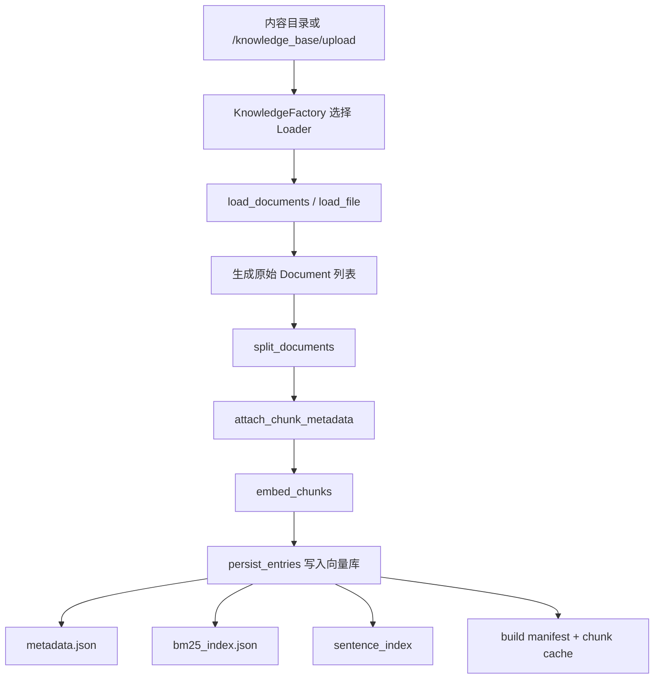

# Mini-Agent-RAG2 RAG 项目流程总览

本文按“数据准备 -> Chunk 切分 -> 增强 -> 向量化 -> 检索 -> 召回 -> 重排 -> 过滤 -> 生成 -> 构造 Prompt -> 生成答案 -> 控制 hallucination”的顺序，梳理当前项目的 RAG 设计与代码落点。

适用范围：
- 本地知识库问答：`source_type=local_kb`
- 临时知识库问答：`source_type=temp_kb`
- 多模态文档：文本、Markdown、PDF、DOCX、EPUB、图片

核心结论：
- 这个项目不是“只做向量检索”的基础 RAG，而是一个带有增量建库、混合检索、句级副索引、多模态增强、模型重排、答案审校的增强版 RAG。
- 整体可以拆成两条主链路：
  - 建库链路：把原始文件变成可检索的索引
  - 问答链路：把用户问题变成检索、重排、生成答案的过程

## 1. 总体流线图


## 2. 建库链路流线图



## 3. 问答链路流线图

```mermaid
flowchart TD
    A[用户问题] --> B[/chat/rag -> rag_chat]
    B --> C[resolve_rag_request]
    C --> D[search_local_knowledge_base]
    D --> E[search_vector_store]
    E --> F[generate_multi_queries / generate_hypothetical_doc]
    F --> G[Dense / BM25 / Sentence Recall]
    G --> H[Fused Candidates]
    H --> I[heuristic_rerank_candidates]
    I --> J[rerank_texts 模型重排]
    J --> K[score_threshold + 模态覆盖 + 去同质化]
    K --> L[candidate_to_reference]
    L --> M[generate_rag_answer]
    M --> N[build_rag_prompt + build_context]
    N --> O[LLM invoke]
    O --> P[maybe_refine_rag_answer]
    P --> Q[最终答案]
```

## 4. 阶段式介绍

| 阶段 | 项目里实际在做什么 | 核心文件 / 函数 |
| --- | --- | --- |
| 数据准备 | 收集本地文件或上传文件，识别文件类型，解析成 LangChain `Document` | `app/api/knowledge_base.py` `upload_knowledge_base_files()`，`app/services/kb_ingestion_service.py`，`app/loaders/factory.py` |
| Chunk 切分 | 按中文递归切分或按 Markdown 标题切分，并补充 chunk 元数据 | `app/chains/text_splitter.py` `split_documents()`，`app/services/embedding_assembler.py` `attach_chunk_metadata()` |
| 增强 | 图像 OCR、图片描述、说明书页结构化抽取、Query Rewrite、Multi-Query、HyDE、句级索引等 | `app/loaders/image.py`，`app/services/query_rewrite_service.py`，`app/services/sentence_index_service.py` |
| 向量化 | 批量 embedding，写入 FAISS/Chroma，并保存 metadata/BM25/manifest/cache | `app/services/embedding_assembler.py`，`app/services/embedding_service.py`，`app/storage/vector_stores.py` |
| 检索 | 收到 query 后加载索引和文档，准备进入召回 | `app/api/chat.py` `resolve_rag_request()`，`app/retrievers/local_kb.py` `search_vector_store()` |
| 召回 | 向量召回、BM25 召回、句级召回，并做融合打分 | `app/retrievers/local_kb.py` `collect_dense_candidates()` `collect_lexical_candidates()` `collect_sentence_dense_candidates()` `retrieve_candidates()` |
| 重排 | 先启发式重排，再可选 CrossEncoder 模型重排 | `app/retrievers/local_kb.py` `heuristic_rerank_candidates()` `rerank_candidates()`，`app/services/rerank_service.py` |
| 过滤 | 阈值过滤、模态覆盖、去重、去同质化、多样性选择、小到大上下文扩展 | `app/retrievers/local_kb.py` `ensure_modality_coverage()` `diversify_candidates()` `candidate_to_reference()` |
| 生成 | 进入 RAG chain，准备回答 | `app/chains/rag.py` `generate_rag_answer()` 或 `stream_rag_answer()` |
| 构造 Prompt | 系统提示词、上下文分组、历史消息、覆盖要求、长期记忆注入 | `app/chains/rag.py` `build_rag_prompt()` `build_rag_variables()` `build_context()` |
| 生成答案 | 调 LLM 生成非流式或流式答案 | `app/services/llm_service.py` `build_chat_model()`，`app/services/streaming_llm.py` |
| 控制 hallucination | 提示词约束、证据不足兜底、二次补检索、答案完备性审校、事实审校 | `app/chains/rag.py` `maybe_run_corrective_retrieval()` `maybe_refine_rag_answer()` |

## 5. 数据准备

### 5.1 入口

项目主要有两种准备数据的方式：

- 本地知识库：
  - 文件放到知识库目录
  - 或通过 `POST /knowledge_base/upload` 上传到 `scope=local`
  - 再通过 `POST /knowledge_base/rebuild` 或 `auto_rebuild=true` 触发建库
- 临时知识库：
  - 通过 `POST /knowledge_base/upload` 上传到 `scope=temp`
  - 上传后直接完成解析、切片、向量化、建索引

对应代码：

- `app/api/knowledge_base.py`
- `app/services/kb_ingestion_service.py`
- `app/services/kb_incremental_rebuild.py`

### 5.2 文件类型与 Loader

项目通过 `KnowledgeFactory` 为不同扩展名选择不同 Loader：

- `.txt` -> `TextKnowledge`
- `.md` -> `MarkdownKnowledge`
- `.pdf` -> `PdfKnowledge`
- `.docx` -> `DocxKnowledge`
- `.epub` -> `EpubKnowledge`
- 图片 `.png/.jpg/.jpeg/.bmp/.webp` -> `ImageKnowledge`

对应代码：

- `app/loaders/factory.py`
- `app/loaders/text.py`
- `app/loaders/pdf.py`
- `app/loaders/office.py`
- `app/loaders/image.py`

### 5.3 文档解析细节

不同文件会在数据准备阶段直接做结构化处理：

- PDF：
  - 优先按目录大纲切 section
  - 没有大纲时退化成逐页 `Document`
- DOCX：
  - 优先识别标题样式，按标题层级切 section
  - 没有结构时退化为整篇文本
- EPUB：
  - 按 spine/HTML section 解析
- 图片：
  - 先做 OCR
  - 再按配置决定是否做整图 caption
  - 还能生成区域 caption
  - 如果像“说明书步骤页”，会额外抽取步骤、部件、配图说明等结构化证据

额外补充：

- 每个文件在进入下游前都会带上基础 metadata：
  - `source`
  - `source_path`
  - `relative_path`
  - `extension`
  - `title`
  - `content_type`
  - `source_modality`
  - `original_file_type`
  - `evidence_summary`
- 还支持从 `.rag_file_metadata.json` 注入 sidecar 元数据。

## 6. Chunk 切分

### 6.1 切分器

切分器主要在 `app/chains/text_splitter.py`：

- 默认：`ChineseRecursiveTextSplitter`
- Markdown 文件自动切到 `MarkdownHeaderTextSplitter`

默认配置来自 `configs/kb_settings.yaml`：

- `CHUNK_SIZE: 400`
- `CHUNK_OVERLAP: 80`
- `TEXT_SPLITTER_NAME: ChineseRecursiveTextSplitter`

### 6.2 切分策略

- 普通中文文本：
  - 按段落、换行、句号、问号、分号、逗号等递归切分
- Markdown：
  - 先按 `# / ## / ###` 提取章节
  - 再对章节内部做递归切分

### 6.3 Chunk 元数据补齐

切完后，`attach_chunk_metadata()` 会为每个 chunk 补齐：

- `chunk_id`
- `chunk_index`
- `doc_id`
- `page/page_end`
- `section_title`
- `section_path`
- `section_index`
- `headers`
- `ocr_text`
- `image_caption`
- `evidence_summary`

这一步很重要，因为后续 BM25、句级索引、重排、Prompt 构造都依赖这些 metadata。

## 7. 增强

这里的“增强”分成建库时增强和查询时增强两类。

### 7.1 建库时增强

#### 7.1.1 图像增强

在 `app/loaders/image.py` 中，图片文档不是简单 OCR 一次就结束，而是可能生成多类证据：

- OCR 文本证据
- 整图结构化视觉描述
- 区域视觉描述
- 说明书步骤文本证据
- 说明书配图/箭头等视觉证据

这意味着图片会被拆成多个可检索 `Document`，而不是只保留一段 OCR 结果。

#### 7.1.2 句级副索引

项目会从 chunk 继续向下拆句，构建 sentence index：

- 跳过纯视觉 chunk
- 对文本 chunk 按句子/子句切分
- 为句子生成额外 embedding
- 建立独立的句级向量索引与 BM25 索引

对应代码：

- `app/services/sentence_index_service.py`

它的价值是：

- 主 chunk 负责全局语义
- 句级索引负责更精确的局部命中

#### 7.1.3 增量重建

本项目默认启用了增量建库，不是每次都全量重算。

默认开关：

- `ENABLE_INCREMENTAL_REBUILD: true`
- `ENABLE_FILE_HASH_CACHE: true`
- `ENABLE_CHUNK_CACHE: true`
- `ENABLE_APPEND_INDEX: true`

`plan_rebuild()` 会把一次 rebuild 规划成三种模式：

- `reuse`：文件没变，直接复用旧 chunk cache 和旧索引
- `append`：只有新增文件，允许只 append 新向量
- `full`：有删除、修改或配置变化，触发全量重建

对应代码：

- `app/services/kb_incremental_rebuild.py`

### 7.2 查询时增强

#### 7.2.1 Query Rewrite / Multi-Query

在检索前，项目会先做查询增强：

- 保留原始 query
- 可生成多条改写 query
- 时间敏感问题会尽量保留“当前/最新/今年”等时间约束

对应代码：

- `app/services/query_rewrite_service.py` `generate_multi_queries()`

#### 7.2.2 HyDE

如果启用 `ENABLE_HYDE`，还会额外生成一段“假设文档”，只用于 dense retrieval，不直接展示给用户。

对应代码：

- `app/services/query_rewrite_service.py` `generate_hypothetical_doc()`

当前默认配置里：

- `ENABLE_HYDE: false`

#### 7.2.3 小到大上下文

在最终返回引用时，项目支持 `ENABLE_SMALL_TO_BIG_CONTEXT`：

- 检索命中某个 chunk
- 最终回答时可把前后相邻 chunk 一起扩成更完整上下文

默认配置：

- `ENABLE_SMALL_TO_BIG_CONTEXT: true`
- `SMALL_TO_BIG_EXPAND_CHUNKS: 1`

## 8. 向量化

### 8.1 Embedding 构建

向量化在 `EmbeddingAssembler` 里完成：

1. `split_loaded_documents()` 切 chunk
2. `embed_chunks()` 批量 embedding
3. `persist_entries()` 写入向量库

底层 embedding 入口：

- `app/services/embedding_service.py` `build_embeddings()`

支持两类 provider：

- `ollama`
- `openai_compatible`

默认批大小：

- `EMBEDDING_BATCH_SIZE: 64`

### 8.2 存储结果

向量化后并不是只写一个 FAISS 文件，而是同时维护多份检索资产：

- 向量库：
  - 默认 `faiss`
  - 可选 `chroma`
- `metadata.json`
- `bm25_index.json`
- `sentence_index/`
- build manifest
- chunk cache 与 `.npy` embedding cache

对应代码：

- `app/storage/vector_stores.py`
- `app/storage/bm25_index.py`
- `app/services/kb_incremental_rebuild.py`

## 9. 检索

### 9.1 问答入口

用户问题进入：

- `app/api/chat.py` `rag_chat()`

然后先调用：

- `resolve_rag_request()`

如果是本地知识库，会继续进入：

- `search_local_knowledge_base()`
- `search_vector_store()`

如果是临时知识库，则改为：

- `search_temp_knowledge_base()`

### 9.2 检索前准备

`search_vector_store()` 会先做这些准备动作：

- 加载 embedding 模型
- 加载向量库 adapter
- 加载全部文档 metadata
- 应用 `metadata_filters`
- 加载 BM25 索引
- 生成 `query_bundle`
- 生成 `dense_query_bundle`
- 推断 query 类型、模态偏好、时间偏好

这里的“检索”更像是进入检索阶段并准备好多路召回所需的输入。

## 10. 召回

为了和“检索”区分，本文把真正拿候选的阶段叫“召回”。

### 10.1 Dense 召回

`collect_dense_candidates()`：

- 遍历 `query_bundle` 或 `dense_query_bundle`
- 调用 `vector_store.similarity_search_with_score()`
- 收集每个 chunk 的最佳 dense 命中

如果启用了按模态分组 dense 检索，还会按 `source_modality` 分桶召回。

### 10.2 BM25 召回

`collect_lexical_candidates()`：

- 对 query 做 term 提取
- 用 `score_bm25_index()` 对 chunk 打 lexical score
- 弥补纯向量对精确关键词、编号、术语的召回不足

### 10.3 句级召回

如果句级索引开启且 query 适合句级检索，则：

- `collect_sentence_dense_candidates()`

它不会直接返回句子作为最终结果，而是把句命中的得分和句文本挂回父 chunk，用于后续重排。

### 10.4 融合

`retrieve_candidates()` 会把多路召回合成 `fused_score`：

- Reciprocal Rank Fusion
- dense relevance 权重
- lexical score 权重
- 模态 bonus
- 时间 bonus

默认相关配置：

- `HYBRID_DENSE_TOP_K: 50`
- `HYBRID_LEXICAL_TOP_K: 50`
- `HYBRID_RRF_K: 60`
- `HYBRID_DENSE_SCORE_WEIGHT: 0.35`
- `HYBRID_LEXICAL_SCORE_WEIGHT: 0.25`
- `SENTENCE_INDEX_SCORE_WEIGHT: 0.12`

## 11. 重排

### 11.1 启发式重排

第一层重排是 `heuristic_rerank_candidates()`：

- 看 fused score
- 看 dense score
- 看 lexical score
- 看 query term overlap
- 看正文 overlap
- 看 answer window overlap
- 看 phrase 命中
- 看标准化字符串命中
- 看来源标题/文件名 bonus
- 看模态 bonus
- 看时间 bonus

项目还会构造“answer window”与“query-focused window”，让重排更偏向真正能回答问题的局部文本，而不是整 chunk 平均得分。

### 11.2 模型重排

第二层是 `rerank_texts()`：

- 先给候选构造适合 CrossEncoder 的 rerank text
- 再通过 `sentence-transformers` CrossEncoder 打分
- 最后把模型分和启发式分做融合

对应代码：

- `app/retrievers/local_kb.py` `rerank_candidates()`
- `app/services/rerank_service.py`

默认配置：

- `ENABLE_MODEL_RERANK: true`
- `ENABLE_HEURISTIC_RERANK: true`
- `RERANK_CANDIDATES_TOP_N: 20`
- `RERANK_FALLBACK_TO_HEURISTIC: true`

## 12. 过滤

这个项目的“过滤”不是单一一步，而是由多个阶段组成。

### 12.1 元数据过滤

最早的过滤发生在 `search_vector_store()`：

- `filter_documents_by_metadata()`

它会先把不符合 metadata 条件的文档排除掉。

### 12.2 阈值过滤

重排后，系统会按：

- `relevance_score >= score_threshold`

过滤掉低相关候选。

默认阈值：

- `SCORE_THRESHOLD: 0.5`

### 12.3 模态覆盖过滤

对于图片相关或多模态联合问题，系统不是简单取 Top-K，而是会优先保证必要模态被覆盖：

- `ensure_modality_coverage()`

例如：

- 图片问题优先保留 `ocr / vision / image`
- 图文联合问题优先保留 `text + image side`

### 12.4 去同质化与多样性

最终候选还会经过：

- `diversify_candidates()`
- `select_family_diverse_candidates()`
- 同 sample group 的 dominance 调整

目的是避免最终引用全都来自同一份文档、同一组样本或同一类证据。

### 12.5 小到大上下文扩展

最终 `candidate_to_reference()` 会在返回引用时调用 `build_expanded_content()`：

- 如果命中的是小 chunk
- 会补上相邻 chunk
- 让 LLM 看到更完整语境

这一步本质上也是一种“回答前过滤与重构上下文”。

## 13. 生成

### 13.1 RAG Chain 入口

当候选引用准备好后，系统进入：

- 非流式：`generate_rag_answer()`
- 流式：`stream_rag_answer()`

入口文件：

- `app/chains/rag.py`

### 13.2 流式与非流式差异

- 非流式路径：
  - 会走答案审校 `maybe_refine_rag_answer()`
- 流式路径：
  - 直接逐 token 输出
  - 不走最后的审校修订

所以如果你在答辩里讲“最终答案会二次审校”，要补一句：

- 这是非流式路径的能力
- 流式路径为了实时性跳过了这一步

## 14. 构造 Prompt

### 14.1 系统提示词

`build_rag_prompt()` 会根据问题类型自动选择：

- 普通文本 RAG Prompt
- 图片/多模态 RAG Prompt

图片 Prompt 会特别强调：

- OCR 是直接文本证据，但可能识别错
- 视觉描述只代表“看到的内容”，不能当绝对事实扩展
- OCR 和视觉描述冲突时要明确指出

### 14.2 Prompt 变量

`build_rag_variables()` 会把这些内容拼进 Prompt：

- 对话历史 `history`
- 长期记忆 `memory_section`
- 检索上下文 `context`
- 覆盖要求 `coverage_requirements`
- 当前 query

### 14.3 上下文组织方式

`build_context()` 不会把所有引用混成一团，而是按证据类型分组：

- 文本证据
- OCR 证据
- 视觉描述证据

每条证据块还会携带：

- source
- page
- section
- modality
- content_type
- relevance
- evidence_summary
- ocr_text / image_caption / content preview

这对多模态场景非常重要，因为它显式告诉模型“哪部分是文字、哪部分是视觉描述”。

### 14.4 多子问题覆盖要求

`build_coverage_requirements()` 会把复合问题拆成多个回答要求，例如：

- 分别
- 同时
- 以及
- 哪些
- 原因
- 措施
- 步骤

然后把这些子要求塞进 Prompt，提醒模型不要漏答。

## 15. 生成答案

### 15.1 模型调用

`generate_rag_answer()` 的核心顺序是：

1. `build_rag_prompt()`
2. `build_rag_variables()`
3. `build_chat_model()`
4. `chain.invoke()`
5. `maybe_refine_rag_answer()`

底层模型入口：

- `app/services/llm_service.py` `build_chat_model()`

支持：

- `ollama`
- `openai_compatible`

### 15.2 流式输出

流式路径用：

- `app/services/streaming_llm.py` `stream_prompt_output()`

由 `llm.stream(prompt_value)` 持续吐出 token。

## 16. 控制 hallucination

本项目控制 hallucination 不是靠单点，而是靠多层防护。

### 16.1 提示词级约束

系统提示词已经明确要求模型：

- 优先依据提供上下文回答
- 不要编造上下文中不存在的事实
- 上下文不足时要明确说“根据当前检索到的内容，无法确定”
- 多子问题要逐项覆盖
- OCR 证据和视觉描述证据不要混为一类事实

这是第一层防护。

### 16.2 检索级约束

通过：

- Query Rewrite / Multi-Query
- 混合检索
- 句级索引
- 模型重排
- 小到大上下文

让送进 Prompt 的证据更相关、更完整，减少“因为证据弱而胡编”的概率。

这是第二层防护。

### 16.3 Corrective RAG

如果开启：

- `ENABLE_CORRECTIVE_RAG`

系统会：

1. `grade_documents()` 评估当前证据是否够用
2. `generate_corrective_query()` 生成更聚焦的二次查询
3. 再做第二轮检索
4. 如果开启 web supplement，还可补充网络搜索证据

对应代码：

- `app/chains/rag.py` `maybe_run_corrective_retrieval()`

当前默认配置里：

- `ENABLE_CORRECTIVE_RAG: false`
- `ENABLE_CORRECTIVE_WEB_SEARCH: false`

也就是说，这条链路已经实现，但默认未启用。

### 16.4 答案审校

非流式答案生成后，还会进入 `maybe_refine_rag_answer()`：

- 完备性审校：
  - 检查是否漏答、是否遗漏并列要点、是否丢失角色职责
- 事实审校：
  - 删除或缩写证据不支持的断言
  - 避免主语错配、时间外推、因果外推

这相当于在最终答案输出前又加了一层“小审稿人”。

### 16.5 多模态证据分流

在多模态问题里，项目不是简单把文本和图像混起来，而是：

- 检索时保留 `source_modality`
- Prompt 中分组展示 `text / ocr / vision`
- 图片专用 Prompt 明确要求不要把视觉描述当作铁证

这能明显降低多模态 RAG 常见的“看图胡猜”问题。

## 17. 从代码视角看，这个项目最有特色的地方

如果你需要用一段话概括项目特色，可以直接这样说：

> 这个项目的 RAG 不是简单的“文档切片 + 向量检索 + 大模型生成”，而是做成了一套增强版流程：上游支持多种文档与图片解析，图片侧带 OCR、区域描述和说明书结构抽取；中间层支持增量建库、BM25、句级副索引、混合召回和模型重排；下游生成阶段又加入了多模态 Prompt 分流、覆盖要求约束、可选 corrective retrieval，以及非流式答案的完备性与事实审校，因此整体上更像一个工程化 RAG 系统，而不是单一 demo。

## 18. 关键代码地图

### 18.1 建库相关

- `app/api/knowledge_base.py`
- `app/services/kb_ingestion_service.py`
- `app/services/kb_incremental_rebuild.py`
- `app/services/embedding_assembler.py`
- `app/chains/text_splitter.py`
- `app/loaders/factory.py`
- `app/loaders/text.py`
- `app/loaders/pdf.py`
- `app/loaders/office.py`
- `app/loaders/image.py`
- `app/services/sentence_index_service.py`
- `app/storage/vector_stores.py`
- `app/storage/bm25_index.py`

### 18.2 问答相关

- `app/api/chat.py`
- `app/retrievers/local_kb.py`
- `app/services/query_rewrite_service.py`
- `app/services/rerank_service.py`
- `app/chains/rag.py`
- `app/services/llm_service.py`
- `app/services/streaming_llm.py`

## 19. 默认配置快照

当前 `configs/kb_settings.yaml` 中对整体流程影响最大的默认配置如下：

| 配置 | 当前值 | 含义 |
| --- | --- | --- |
| `DEFAULT_VS_TYPE` | `faiss` | 默认向量库存储类型 |
| `CHUNK_SIZE` | `400` | 默认 chunk 大小 |
| `CHUNK_OVERLAP` | `80` | 默认 chunk overlap |
| `ENABLE_QUERY_REWRITE` | `true` | 开启 query 改写 |
| `ENABLE_MULTI_QUERY_RETRIEVAL` | `true` | 开启多查询检索 |
| `ENABLE_HYBRID_RETRIEVAL` | `true` | 开启 dense + BM25 混合检索 |
| `ENABLE_MODEL_RERANK` | `true` | 开启模型重排 |
| `ENABLE_SENTENCE_INDEX` | `true` | 开启句级副索引 |
| `ENABLE_INCREMENTAL_REBUILD` | `true` | 开启增量建库 |
| `ENABLE_SMALL_TO_BIG_CONTEXT` | `true` | 回答前扩展相邻 chunk |
| `IMAGE_OCR_ENABLED` | `true` | 图片 OCR 默认开启 |
| `ENABLE_HYDE` | `false` | HyDE 已实现，默认关闭 |
| `ENABLE_CORRECTIVE_RAG` | `false` | corrective retrieval 已实现，默认关闭 |

## 20. 答辩/汇报时的推荐讲法

如果你需要用 1 分钟介绍这个项目，可以按下面这个顺序讲：

1. 先说这是“两条链路”的 RAG：建库链路和问答链路。
2. 建库链路里重点讲：多格式 Loader、图片 OCR/视觉增强、Chunk 切分、Embedding、FAISS + BM25 + 句级索引、增量重建。
3. 问答链路里重点讲：Query Rewrite、多路召回、启发式 + 模型重排、阈值过滤与多样性控制、Prompt 构造、答案审校。
4. 最后强调 hallucination 控制不是靠一句 Prompt，而是“检索增强 + 证据分流 + 二次审校”的组合设计。

如果你需要，我下一步可以继续把这份文档再压缩成一版“答辩 PPT 口播稿”，或者整理成“架构图 + 3 分钟讲稿”版本。
