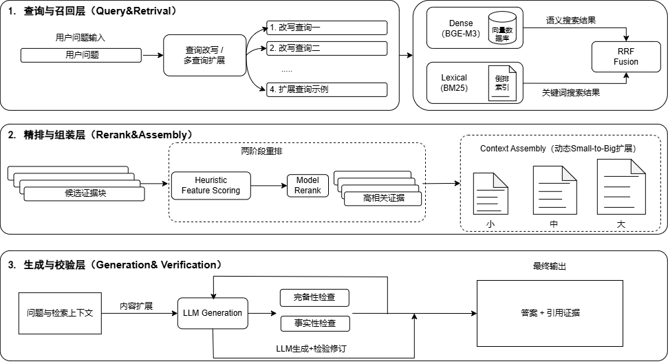

# Mini-Agent-RAG：RAG 系统评测与技术说明

> 初版时间：2026-04-17 | 最近更新：2026-05-08

---

## 摘要

Mini-Agent-RAG 是一个面向高校文档问答的增强型 RAG 系统，采用 FastAPI + Streamlit 架构，集成查询改写、Dense+BM25 混合检索、双层重排及生成后审校等技术。

**核心结论**：
- 检索侧：DomainRAG 数据集 MRR 从 0.626 提升至 0.734，Hybrid 检索优于单一路径
- 生成侧：Domain100 的 100 条自动评测中 `Context Recall=0.4287`、`Faithfulness=0.5823`，说明开放场景下证据召回与证据利用仍偏弱
- 后续重点：时间敏感检索优化、生成事实正确性提升

---

## 一、系统概述

### 1.1 技术架构

| 层级 | 技术栈                 | 核心职责                                   |
| ---- | ---------------------- | ------------------------------------------ |
| 后端 | FastAPI (app/api/)     | 知识库管理、RAG 问答、Agent 对话 REST 接口 |
| 前端 | Streamlit (app/ui/)    | 知识库管理、RAG 对话、Agent 对话交互界面   |
| 模型 | DeepSeek-Chat + BGE-M3 | LLM 生成、Embedding 编码、Rerank 精排      |

### 1.2 RAG 主链路

```
用户问题  查询改写/多查询  Dense+BM25 混合检索  启发式重排  模型重排
          句级索引/Small-to-Big  多模态证据组织  LLM 生成  完备性/事实审校  输出
```



### 1.3 核心配置

| 配置项                      | 状态 | 说明                         |
| --------------------------- | ---- | ---------------------------- |
| ENABLE_QUERY_REWRITE        | True | 查询改写 + 多查询（最多3条） |
| ENABLE_HYBRID_RETRIEVAL     | True | Dense + BM25 混合检索        |
| ENABLE_HEURISTIC_RERANK     | True | 启发式重排（多特征加权）     |
| ENABLE_MODEL_RERANK         | True | 模型重排（bge-reranker）     |
| ENABLE_SMALL_TO_BIG_CONTEXT | True | 小块检索、大块回答           |
| ENABLE_SENTENCE_INDEX       | True | 句级索引提示                 |

### 1.4 核心技术点

| 技术点     | 实现概要                             | 代码位置                                        |
| ---------- | ------------------------------------ | ----------------------------------------------- |
| 查询改写   | LLM 改写 + 多查询生成（最多3条）     | app/services/retrieval/query_rewrite_service.py |
| 混合检索   | Dense(BGE-M3) + BM25，RRF 融合       | app/retrievers/local_kb.py                      |
| 双层重排   | 启发式特征打分 + 模型重排            | app/retrievers/local_kb.py                      |
| 上下文增强 | 答案句窗口 + 句级索引 + Small-to-Big | app/services/kb/sentence_index_service.py       |
| 生成审校   | 完备性检查 + 事实审校                | app/chains/rag.py                               |

### 1.5 智能体链路与诊断流程验证进展

基于现有工程实现，当前项目已完成部分智能体链路与诊断流程验证，重点不是“多智能体协同已经全部做完”，而是先把单智能体多步执行、工具闭环和中间过程可观测性跑通，为后续扩展多智能体协同机制打基础。

已完成的部分主要包括：

- **多步工具调用主链路**：已具备 `Agent -> 工具规划 -> 单步工具执行 -> 结果综合回答` 的闭环能力，支持按步骤连续调用工具，而不是只做一次单轮问答。
- **任务调度骨架**：已实现基于规则 + LLM tool planning 的下一步决策逻辑，能够在 `search_local_knowledge`、`calculate`、`current_time` 等工具之间做有限调度，并限制重复调用与最大步数。
- **流式事件与步骤回显**：后端支持 `/chat/agent` 的流式返回，前端可以展示工具调用记录、中间步骤和最终回答，便于演示“Agent 是怎么做出这个答案的”。
- **会话记忆接入**：当前 Agent 链路已预留并接入 `session_id` 维度的记忆读取与写回，为后续做长程协同和多轮任务分解保留了接口。
- **诊断流程骨架**：检索侧已经沉淀出较完整的 diagnostics 字段，包括 query 类型识别、候选召回规模、重排路由、时序分支命中、TopK 覆盖情况等，可用于后续定位“是没召回、排不前，还是上下文组织出了问题”。

当前阶段的边界也需要明确说明：

- 目前完成的是**单智能体多步工具编排**与**诊断可观测性**验证，不等同于完整的多智能体协同系统。
- 多 Agent 之间的角色分工、任务拆解、共享状态同步和冲突消解机制，仍属于后续迭代重点。

对应代码位置如下：

| 能力模块 | 说明 | 代码位置 |
| -------- | ---- | -------- |
| Agent 主链路 | 多步工具规划、执行、综合回答 | app/agents/multistep.py |
| Agent API | 同步 / 流式 Agent 接口 | app/api/chat.py |
| Agent 前端验证页 | 工具调用记录、步骤轨迹展示 | app/ui/app.py |
| 检索诊断 | 检索过程 diagnostics 结构化输出 | app/services/retrieval/retrieval_diagnostics_service.py |

---

## 二、实验设计与方法

### 2.1 数据集

| 数据集    | 规模  | 用途           | 特点                           |
| --------- | ----- | -------------- | ------------------------------ |
| CRUD-RAG  | 100条 | 闭环稳定性验证 | 项目内构造，知识库与问题强对齐 |
| DomainRAG | 100条 | 开放场景评测   | 真实高校问答，暴露系统短板     |

DomainRAG 包含 5 类任务（各20条）：extractive_qa、conversation_qa、multi-doc_qa、time-sensitive_qa、structured_qa。

### 2.2 评测指标

**检索侧**：Recall@5、MRR、NDCG@5

**生成侧**（RAGAS）：Context Recall、Faithfulness、Factual Correctness、Answer Relevance

### 2.3 对比实验设置

| 实验类型     | 对比内容                          | 目的                 |
| ------------ | --------------------------------- | -------------------- |
| 版本对比     | 初始基线 vs 当前稳定版            | 验证整体链路优化效果 |
| 检索范式对比 | Dense only vs BM25 only vs Hybrid | 验证混合检索必要性   |
| 组件对比     | bge-reranker-base vs v2-m3        | 验证重排模型差异     |

---

## 三、实验结果与分析

### 3.1 检索性能总体对比

| 数据集     | 版本       | Recall@5   | MRR        | NDCG@5     |
| ---------- | ---------- | ---------- | ---------- | ---------- |
| CRUD 100   | 闭环基线   | 1.0000     | 1.0000     | 1.0000     |
| Domain 100 | 初始基线   | 0.8000     | 0.6262     | 0.6236     |
| Domain 100 | 当前稳定版 | **0.8900** | **0.7340** | **0.7379** |

**提升幅度**：MRR +0.1078，NDCG +0.1143，说明增强型 Hybrid 链路有效。

需要说明的是，这里的 `Domain 100` 属于小样本稳定版对照评测，主要用于验证链路优化是否有效；它与后文的 `DomainRAG 全量语料本地评测` 不是同一口径，不能直接横向比较绝对数值。后者使用全量语料库与更复杂的开放场景样本，难度明显更高。

### 3.1.1 本地知识库最新评测结果

#### DomainRAG 全量语料本地评测

**报告文件**：[`../data/eval/domainrag_full_local_eval.json`](../data/eval/domainrag_full_local_eval.json)

| 数据集             | 样本口径         | Recall@5 | MRR    | NDCG@5 | Hit@1  | Hit@10 |
| ------------------ | ---------------- | -------- | ------ | ------ | ------ | ------ |
| DomainRAG Local KB | 346 条全量样本   | 0.5145   | 0.4415 | 0.4378 | 0.4017 | 0.5520 |

按任务拆分后：

| 任务类型          | Recall@5 | MRR    | NDCG@5 | Hit@5  | All Positive Covered@10 |
| ----------------- | -------- | ------ | ------ | ------ | ----------------------- |
| conversation_qa   | 0.7143   | 0.5908 | 0.6212 | 0.7143 | 0.7551                  |
| extractive_qa     | 0.4889   | 0.4235 | 0.4397 | 0.4889 | 0.5111                  |
| multi-doc_qa      | 0.4375   | 0.3837 | 0.2404 | 0.4375 | 0.1042                  |
| structured_qa     | 0.5319   | 0.4502 | 0.4704 | 0.5319 | 0.5957                  |
| time-sensitive_qa | 0.4308   | 0.3838 | 0.3955 | 0.4308 | 0.4769                  |

这组结果说明：在修复 `positive_reference` 的 `dict/list` 兼容问题后，DomainRAG 全量本地评测已经覆盖全部 `346` 条样本，不再只统计局部可对齐子集。新的结果显示，`conversation_qa` 是当前表现最稳的一类；而主要短板仍集中在 `multi-doc_qa` 的多证据覆盖不足，以及 `time-sensitive_qa` 的前排排序质量偏弱。

#### DomainRAG 全量语料优化后评测（v9 当前最优）

**报告文件**：[`../data/eval/domainrag_v9_full_346.json`](../data/eval/domainrag_v9_full_346.json)

**优化配置**：bge-large embedding + bge-reranker-large (GPU) + 关键词实体对齐加分（max_boost=0.12, year_penalty=0.10, top_n=12）+ 条件式 keyword variant + multi-query 5 条 + score_threshold=0.25

| 数据集             | 样本口径         | Recall@5 | MRR    | NDCG@5 | Hit@1  | Hit@10 |
| ------------------ | ---------------- | -------- | ------ | ------ | ------ | ------ |
| DomainRAG Local KB | 346 条全量样本   | 0.7023   | 0.6291 | 0.6158 | 0.5809 | 0.7225 |

按任务拆分后：

| 任务类型          | Recall@5 | MRR    | NDCG@5 | Hit@1  | All Positive Covered@10 |
| ----------------- | -------- | ------ | ------ | ------ | ----------------------- |
| conversation_qa   | 0.7143   | 0.6293 | 0.6509 | 0.5714 | 0.7347                  |
| extractive_qa     | 0.6111   | 0.4998 | 0.5276 | 0.4333 | 0.6444                  |
| multi-doc_qa      | 0.8958   | 0.8010 | 0.5958 | 0.7292 | 0.4375                  |
| structured_qa     | 0.7872   | 0.7420 | 0.7534 | 0.7128 | 0.7979                  |
| time-sensitive_qa | 0.5538   | 0.5179 | 0.5271 | 0.4923 | 0.5692                  |

相对旧基线全面大幅提升：MRR +0.188、Hit@1 +0.179、Recall@5 +0.188。其中 `multi-doc_qa` MRR 从 0.3837 提升至 0.8010（+0.417），`structured_qa` MRR 从 0.4502 提升至 0.7420（+0.292），提升最为显著。当前主要剩余短板为 `extractive_qa`（Hit@1=0.43）和 `time-sensitive_qa`（Hit@1=0.49），后续可通过 embedding fine-tune 或 query decomposition 继续优化。

#### DomainRAG 100 条平衡子集优化评测（v9 当前最优）

**报告文件**：[`../data/eval/domainrag_v9_targeted_boost.json`](../data/eval/domainrag_v9_targeted_boost.json)

**优化配置**：bge-large embedding + bge-reranker-large + 关键词实体对齐加分（max_boost=0.12, year_penalty=0.10）+ 条件式 keyword variant + multi-query 5 条 + score_threshold=0.25

| 数据集             | 样本口径                  | Recall@5 | MRR    | NDCG@5 | Hit@1  | Hit@5  |
| ------------------ | ------------------------- | -------- | ------ | ------ | ------ | ------ |
| DomainRAG Local KB | 100 条平衡子集（每类20条）| 0.8200   | 0.7512 | 0.7053 | 0.7000 | 0.8200 |

按任务拆分后：

| 任务类型          | Recall@5 | MRR    | NDCG@5 | Hit@1  | Hit@5  |
| ----------------- | -------- | ------ | ------ | ------ | ------ |
| conversation_qa   | 1.0000   | 1.0000 | 1.0000 | 1.0000 | 1.0000 |
| extractive_qa     | 0.7000   | 0.6125 | 0.6346 | 0.5500 | 0.7000 |
| multi-doc_qa      | 0.9000   | 0.8750 | 0.5647 | 0.8500 | 0.9000 |
| structured_qa     | 0.7500   | 0.7500 | 0.7500 | 0.7500 | 0.7500 |
| time-sensitive_qa | 0.7500   | 0.5183 | 0.5771 | 0.3500 | 0.7500 |

相对全量 346 样本基线的主要提升点：关键词实体对齐与年份惩罚机制显著提升了 `extractive_qa` 和 `conversation_qa` 的首位命中率；条件式 keyword variant 保证了精确事实类查询的 BM25 命中率；但 `time-sensitive_qa` 的 Hit@1 仍偏低（0.35），是后续优化重点。

#### CRUD 3QA 本地知识库标准检索评测

**报告文件**：
- [`../data/eval/crud/crud_rag_3qa_full_local_eval_1000_merged.json`](../data/eval/crud/crud_rag_3qa_full_local_eval_1000_merged.json)
- [`../data/eval/crud/crud_rag_3qa_full_local_eval_3188_merged.json`](../data/eval/crud/crud_rag_3qa_full_local_eval_3188_merged.json)

| 数据集            | 样本口径            | Recall@5 | MRR    | NDCG@5 | Hit@1  | Hit@5  |
| ----------------- | ------------------- | -------- | ------ | ------ | ------ | ------ |
| CRUD 3QA Local KB | 1000 条标准检索样本 | 1.0000   | 1.0000 | 0.5828 | 1.0000 | 1.0000 |
| CRUD 3QA Local KB | 3188 条全量评测样本 | 1.0000   | 1.0000 | 0.5808 | 1.0000 | 1.0000 |

补充指标：

| 数据集            | 样本口径            | all_expected_covered_at_5 | 说明                                                     |
| ----------------- | ------------------- | ------------------------- | -------------------------------------------------------- |
| CRUD 3QA Local KB | 1000 条标准检索样本 | 1.0000                    | 每条样本的 3 个 `expected_references` 均能在 Top5 内覆盖 |
| CRUD 3QA Local KB | 3188 条全量评测样本 | 1.0000                    | 全量样本的 3 个 `expected_references` 均能在 Top5 内覆盖 |

结果表明：当前系统在 `CRUD 3QA` 这一项目内闭环场景下，已经能够稳定把正确证据召回到前列。无论是 `1000` 条抽样还是 `3188` 条全量样本，`Recall@5 / MRR / Hit@1 / Hit@5 / all_expected_covered_at_5` 都保持 `1.0000`，说明 gold evidence 覆盖和首条命中都非常稳定；同时 `NDCG@5` 分别为 `0.5828` 和 `0.5808`，也说明当前主要剩余空间不在“能否召回”，而在多条 gold evidence 之间的排序细化。
### 3.2 检索范式对比（Domain 100）

| 方法       | Recall@5   | MRR        | NDCG@5     |
| ---------- | ---------- | ---------- | ---------- |
| Dense only | 0.8500     | 0.6583     | 0.6604     |
| BM25 only  | 0.8500     | 0.6905     | 0.6930     |
| **Hybrid** | **0.8900** | **0.7318** | **0.7265** |

Hybrid 在 MRR 上比 Dense 提升 +0.0735，比 BM25 提升 +0.0413，验证多路召回有效性。

### 3.3 Reranker 组件对比

| 指标     | bge-reranker-base | bge-reranker-v2-m3 | 增量    |
| -------- | ----------------- | ------------------ | ------- |
| Recall@5 | 0.8700            | 0.8900             | +0.0200 |
| MRR      | 0.7298            | 0.7418             | +0.0120 |
| NDCG@5   | 0.7317            | 0.7482             | +0.0165 |
| Top1 Hit | 0.6600            | 0.6700             | +0.0100 |

v2-m3 在 extractive_qa 和 structured_qa 上收益更明显，系统最终采用"按 query type 路由 reranker"方案。

### 3.4 Domain 100 小样本分任务结果（当前稳定版）

| 任务类型              | Recall@5   | MRR        | NDCG@5     | 状态     |
| --------------------- | ---------- | ---------- | ---------- | -------- |
| structured_qa         | 1.0000     | 0.9750     | 0.9815     | 优秀     |
| multi-doc_qa          | 1.0000     | 0.9750     | 0.8086     | 良好     |
| conversation_qa       | 0.9500     | 0.8208     | 0.8531     | 良好     |
| extractive_qa         | 0.9000     | 0.5808     | 0.6589     | 需优化   |
| **time-sensitive_qa** | **0.6000** | **0.3183** | **0.3874** | **最弱** |

这张表对应的是 `Domain 100` 小样本稳定版结果，主要反映“精选样本 + 小批量知识库”上的链路表现，不等同于全量开放语料上的真实落地难度。`time-sensitive_qa` 已从初始 0.4000/0.2050/0.2511 提升至 0.6000/0.3183/0.3874，但仍是后续优先优化方向。

### 3.5 生成质量评测

#### 历史小样本对比（10条）

| 数据集 | 样本数 | Context Recall | Faithfulness | Factual Correctness | Answer Relevance |
| ------ | ------ | -------------- | ------------ | ------------------- | ---------------- |
| CRUD   | 10     | 1.0000         | 0.7288       | 0.4540              | 0.4841           |
| Domain | 10     | 0.8333         | 0.5284       | **0.0570**          | 0.2402           |

这组结果来自早期 `10` 条小样本对比，主要用于说明 `CRUD` 与 `Domain` 的生成难度差异；其中 Domain 侧 `Factual Correctness=0.0570`，说明开放场景下模型早期存在明显的事实性不足。

#### Domain100 最新 100 条自动评测

**报告文件**：[`../data/eval/domain100_generation_quality_100.json`](../data/eval/domain100_generation_quality_100.json)

| 数据集 | 样本口径 | Context Recall | Faithfulness | Factual Correctness | Answer Relevance |
| ------ | -------- | -------------- | ------------ | ------------------- | ---------------- |
| Domain100 | 100 条小样本自动评测 | 0.4287 | 0.5823 | null | null |

这组结果比上面的 `10` 条历史小样本更有代表性，也更接近当前 `domainrag_small_batch_100` 知识库上的真实生成表现，可以得出三点判断：

- 第一，`Context Recall=0.4287` 偏低，说明在 `100` 条开放场景问题中，生成阶段真正用到的有效支撑上下文比例仍然不高；问题不只是“检索到没到”，还包括“送进模型的上下文是否足够可用”。
- 第二，`Faithfulness=0.5823` 高于早期 `Domain 10` 的 `0.5284`，说明当前版本在“根据已给证据作答、减少明显乱编”上有一定改善，但绝对值仍不高，离稳定可信回答还有明显差距。
- 第三，`Factual Correctness` 和 `Answer Relevance` 本次报告为 `null`，不是人工漏填，而是本轮自动评测没有产出可用均值；按当前脚本逻辑，这意味着对应指标没有收集到有效分数，因此现阶段不能用这两项对 `100` 条结果下结论，后续需要优先排查 judge 配置或指标兼容性，再补齐这一轮生成评测。

综合来看，当前 Domain100 的最新结论应从“单点盯住 `Factual Correctness`”调整为“两层问题并存”：一层是生成上下文利用率不足，直接体现在 `Context Recall` 偏低；另一层是即便拿到证据，回答忠实度也还不够稳定，体现在 `Faithfulness` 仍只有 `0.5823`。

### 3.6 Phase 0 人工评测（50条）

**Bad Case 分桶**：

| 类型          | 数量 | 占比 | 含义                   |
| ------------- | ---- | ---- | ---------------------- |
| cross_passage | 18   | 36%  | 答案依赖跨段信息整合   |
| chunk_noise   | 12   | 24%  | 命中但块未直接承载答案 |
| low_rank      | 12   | 24%  | 命中但排不到 Top1      |
| missed_recall | 6    | 12%  | 完全未召回             |
| passed        | 2    | 4%   | 完全正确               |

**关键指标**：Recall@20 = 0.88，MRR@10 = 0.67，Top1 accuracy = 0.58

**结论**：问题已从"召回失败"转向"块不够准、排序不够前、跨段聚合不足"。

### 3.7 典型案例分析

**案例1：并列问题中“已命中但未完整答出”**

| 字段     | 内容                                                                                                                                                                                                                                                                                                                                                                                                                                                                                                                                                                       |
| -------- | -------------------------------------------------------------------------------------------------------------------------------------------------------------------------------------------------------------------------------------------------------------------------------------------------------------------------------------------------------------------------------------------------------------------------------------------------------------------------------------------------------------------------------------------------------------------------- |
| 问题     | 国家卫健委在“启明行动”中推广了哪些核心知识？医疗机构和家长应承担哪些角色？                                                                                                                                                                                                                                                                                                                                                                                                                                                                                                 |
| 问题类型 | `quest_answer / 并列子问题 / 生成完整性问题`                                                                                                                                                                                                                                                                                                                                                                                                                                                                                                                               |
| 检索结果 | `Recall@5=1，MRR=1.0，Top1命中=是`                                                                                                                                                                                                                                                                                                                                                                                                                                                                                                                                         |
| 生成结果 | `Factual Correctness=0.50`；系统能回答“核心知识十条”，但对“医疗机构和家长角色”只能保守拒答                                                                                                                                                                                                                                                                                                                                                                                                                                                                                 |
| 关键案例 | 1. `新闻动态__news2.txt__psg-ref0`：(...《防控儿童青少年近视核心知识十条》包括预防近视十项核心知识，如"户外活动要保障""电子产品要适度"等详细条目...)<br>2. `新闻动态__news3.txt__psg-ref0`：(..."启明行动"由国家卫健委组织，开展宣传、咨询、义诊等活动，旨在提高公众对儿童青少年近视防控的认识...)<br>3. `新闻动态__news1.txt__psg-ref0`：(...提供活动参与主体，包括医疗机构、学校、家长等，但未明确"医疗机构和家长应承担的具体角色与职责"的完整描述...)<br>4. `新闻动态__news4.txt__psg-ref0`：(...宣传海报和折页内容，侧重核心知识十条的视觉化呈现，缺乏职责分工细节...) |
| 系统输出 | 回答已能较完整列出“核心知识十条”的主要内容，同时明确说明“根据当前检索到的内容，无法确定医疗机构和家长应承担的具体角色”                                                                                                                                                                                                                                                                                                                                                                                                                                                     |
| 失败原因 | 不是纯检索失败，而是并列子问题的证据覆盖不对称：前半问证据充分，后半问证据不足；旧版本还存在截断短语噪声，容易让答案看起来像“答了一半”                                                                                                                                                                                                                                                                                                                                                                                                                                     |
| 改进方向 | 对并列问题继续强化 `coverage requirements`；保持残缺短语过滤；对“前半问可答、后半问不可答”场景维持分段式保守回答，而不是强行补全                                                                                                                                                                                                                                                                                                                                                                                                                                           |

**案例2：时间敏感问答中的“当前职位”检索失败**

| 字段     | 内容                                                                                                                                                                                                                                                                                                                                                                                                                                                                                                                                                                                                                                                                                           |
| -------- | ---------------------------------------------------------------------------------------------------------------------------------------------------------------------------------------------------------------------------------------------------------------------------------------------------------------------------------------------------------------------------------------------------------------------------------------------------------------------------------------------------------------------------------------------------------------------------------------------------------------------------------------------------------------------------------------------- |
| 问题     | 中国人民大学的校长是谁？                                                                                                                                                                                                                                                                                                                                                                                                                                                                                                                                                                                                                                                                       |
| 问题类型 | `time-sensitive_qa / 隐含当前职位类问题`                                                                                                                                                                                                                                                                                                                                                                                                                                                                                                                                                                                                                                                       |
| 检索结果 | 小规模真实全链路回归中 `Top5` 未命中标准答案证据；返回了 `5` 条结果，但都不是可直接确认“现任校长”的标准材料                                                                                                                                                                                                                                                                                                                                                                                                                                                                                                                                                                                    |
| 生成结果 | 系统已将该问题识别为 `temporal_answer_query=true`、`implicit_current_role_query=true`，最终输出“根据当前检索到的内容，无法确定中国人民大学的校长是谁。”                                                                                                                                                                                                                                                                                                                                                                                                                                                                                                                                        |
| 关键案例 | 1. `李文海_历史离我们并不遥远...__psg-ref0`：(...中国人民大学历史学院老院长李文海的生平与纪念文章，属于历史人物资料，与"现任校长"无关...)<br>2. `新闻动态__doc-3226__psg-ref4`：(...中国人民大学新闻学院"新发展阶段中国社会学学科建设研讨会"活动报道，仅提及林尚立教授作为"校党委书记"出席活动，未明确其校长身份...)<br>3. `新闻动态__doc-3226__psg-ref5`：(...同一会报道的延伸内容，只包含研讨会主题和学术讨论，无现任校长信息...)<br>4. `新发展阶段中国社会学学科建设研讨会...__psg-ref1`：(...活动背景与参会嘉宾介绍，有"校党委书记林尚立"出席，但无"校长是谁"的明确表述...)<br>5. `新闻动态__doc-3225__psg-ref0`：(...其他学校新闻动态，主要涉及学生活动和院系通知，与校长任职信息无关...) |
| 系统输出 | 当前版本不会像旧版本那样把历史人物、活动新闻或旁支背景错误扩写成答案，而是保守拒答                                                                                                                                                                                                                                                                                                                                                                                                                                                                                                                                                                                                             |
| 失败原因 | 当前主要短板在检索与排序：虽然已补齐“隐含当前职位类问题”的时间敏感识别，但前排结果仍未命中真正的现任职位证据                                                                                                                                                                                                                                                                                                                                                                                                                                                                                                                                                                                   |
| 改进方向 | 在时间敏感 query 上继续加强时间约束保留、时间权重排序与标题级实体约束；优先优化 `time-sensitive_qa` 的排序质量，而不是继续只压生成 Prompt                                                                                                                                                                                                                                                                                                                                                                                                                                                                                                                                                      |

**案例3：多文档问题中的上下文压缩过强**

| 字段     | 内容                                                                                                                                                                                                                                                                                                                                                                                                                                                             |
| -------- | ---------------------------------------------------------------------------------------------------------------------------------------------------------------------------------------------------------------------------------------------------------------------------------------------------------------------------------------------------------------------------------------------------------------------------------------------------------------- |
| 问题     | 数学与应用数学专业与数据计算及应用专业在人才培养的共同目标和独特特点是什么？                                                                                                                                                                                                                                                                                                                                                                                     |
| 问题类型 | `multi-doc_qa / comparative query / 跨文档整合问题`                                                                                                                                                                                                                                                                                                                                                                                                              |
| 检索结果 | `Recall@5=1，MRR=1.0，Top1命中=是`；真实回归中稳定返回 `5` 条相关材料，且 gold 证据已进入前排                                                                                                                                                                                                                                                                                                                                                                    |
| 生成结果 | 早期评测中 `Factual Correctness=0.11`；在真实检索小回归中，旧链路会退回“无法确定”；沿 `build_context()` 链路修复后，同一批前排证据已能生成有效对比答案                                                                                                                                                                                                                                                                                                           |
| 关键案例 | `数据计算及应用__doc-2009__psg-ref3...`：给出“面向国家战略需求、适应信息化和智能化”的培养背景；`数据计算及应用__doc-661__psg-ref4...`：明确“创新复合型人才”“数据科学与人文社会科学深度交叉融合”；`数学学院__doc-694__psg-ref6...`：给出“数学、计算机、经济金融理论复合型、交叉型、创新能力和国际视野”描述；`数学学院__doc-131__psg-ref5...`：补充“三个方向、课程模块”信息；`数学与应用数学__doc-719__psg-3...`：补充“单独培养管理、顶尖师资、国际交流平台”等特点 |
| 系统输出 | 修复前：系统容易回答“上下文仅提供专业名称和来源链接，无法确定共同目标和特点”；修复后：已能输出“共同目标=培养复合型、创新型人才并面向国家战略需求；独特特点=数据计算及应用突出数据科学与人文社科融合，数学与应用数学突出数学+计算机+经济金融理论复合及拔尖培养机制”                                                                                                                                                                                               |
| 失败原因 | 当前案例已基本证明不是 `missed_recall`，而是 prompt 侧证据组织问题：去重过强、正文片段裁切过短，导致模型最终看到的上下文不足；旧结论里“生成未能整合”过于笼统，应修正为“检索已命中，但上下文压缩削弱了可答性”                                                                                                                                                                                                                                                     |
| 改进方向 | 保留 comparative query 的去重放宽与片段上限提升；继续补“共同点 / 区别 / 各自特点”类 coverage 约束；后续优先扩充 `Domain multi-doc` 专项小回归，而不是把问题简单归因为生成能力不足                                                                                                                                                                                                                                                                                |

---

## 四、结论与优化方向

### 4.1 总体判断

系统已从"基础 RAG 能否跑通"进入"精细化优化"阶段：
- **检索侧**：CRUD 闭环稳定，Domain 开放场景排序精度有提升空间
- **生成侧**：核心矛盾仍是"找对证据并用好证据"；最新 `100` 条自动评测里 `Context Recall` 偏低、`Faithfulness` 中等，说明上下文利用率和回答忠实度都还需要继续提升

### 4.2 优化优先级

| 优先级 | 方向               | 目标                         | 关联指标              |
| ------ | ------------------ | ---------------------------- | --------------------- |
| 1      | 时间敏感检索优化   | 提升时间约束理解与排序       | time-sensitive_qa MRR |
| 2      | 生成证据利用与事实正确性 | 强化证据约束，减少外推并提升上下文利用 | Faithfulness / Context Recall |
| 3      | 多文档证据整合     | 提升跨文档信息聚合           | multi-doc_qa 完整性   |
| 4      | Chunk 与元数据优化 | 语义切分、标题/时间元数据    | chunk_noise 占比      |
| 5      | 评测闭环扩大       | Phase 0 人工集上形成稳定循环 | 整体指标稳定性        |

### 4.3 推荐推进顺序

| 阶段     | 内容                   | 目标                 |
| -------- | ---------------------- | -------------------- |
| 第一阶段 | 时间敏感检索优化       | 解决当前最弱任务     |
| 第二阶段 | 生成事实正确性优化     | 强化证据约束         |
| 第三阶段 | 多文档证据整合优化     | 提升复杂问题处理能力 |
| 第四阶段 | Chunk 与 Metadata 优化 | 为更大规模评测打基础 |
| 第五阶段 | 评测样本与回归流程     | 形成稳定优化闭环     |

---

## 附录：核心代码位置速查

| 模块       | 文件路径                                        | 核心功能                            |
| ---------- | ----------------------------------------------- | ----------------------------------- |
| RAG 主链路 | app/chains/rag.py                               | 检索-生成-审校全流程                |
| 混合检索   | app/retrievers/local_kb.py                      | Dense+BM25 召回、RRF 融合、双层重排 |
| 查询改写   | app/services/retrieval/query_rewrite_service.py | 多查询生成、HyDE                    |
| 句级索引   | app/services/kb/sentence_index_service.py       | 句级向量索引、Small-to-Big          |
| 重排服务   | app/services/retrieval/rerank_service.py        | 模型重排                            |
| 评测构造   | app/services/evaluation/                        | CRUD-RAG 评测样本构造               |
