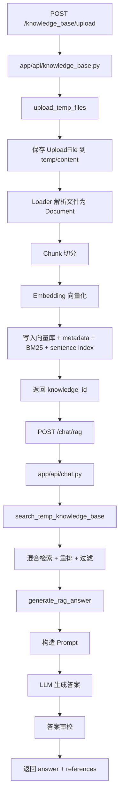

# 上传文档到生成答案样例流程

本文聚焦一个最直观的后端样例流程：

1. 用户上传文档文件
2. 后端解析并建索引
3. 用户发起 `/chat/rag`
4. 系统检索证据并生成答案

为了让这条链路最短、最完整，本文以 `scope=temp` 的临时知识库流程为主，因为它不需要额外手动 rebuild，上传成功后就可以直接问答。

同时，文末会补充 `scope=local` 的差异。

## 1. 样例接口流程

### 1.1 第一步：上传文档

请求：

```http
POST /knowledge_base/upload
Content-Type: multipart/form-data
```

关键参数：

- `scope=temp`
- `files=<你的文档文件>`

返回值里最关键的是：

- `knowledge_id`

后面问答时要带上它。

### 1.2 第二步：发起 RAG 问答

请求：

```http
POST /chat/rag
Content-Type: application/json
```

请求体示例：

```json
{
  "query": "这份文档主要讲了什么？",
  "source_type": "temp_kb",
  "knowledge_id": "temp-xxxxxxxxxxxx",
  "top_k": 5,
  "score_threshold": 0.5,
  "history": [],
  "stream": false
}
```

返回值里最关键的是：

- `answer`
- `references`

## 2. 端到端流线图



## 3. 上传到建索引：经过哪些文件

这部分回答的是：

- 上传的文件先到哪里
- 什么时候变成 `Document`
- 什么时候切 chunk
- 什么时候写向量库

### 3.1 API 入口

入口文件：

- `app/api/knowledge_base.py`

主函数：

- `upload_knowledge_base_files()`

它负责：

- 接收 `FastAPI UploadFile`
- 判断 `scope=temp` 还是 `scope=local`
- 对 `scope=temp` 调用 `upload_temp_files()`

### 3.2 上传服务层

主文件：

- `app/services/kb_ingestion_service.py`

主函数：

- `upload_temp_files()`

它的核心顺序是：

1. 生成 `knowledge_id`
2. 创建临时目录
3. 调 `_save_uploaded_files()` 把文件真正保存到磁盘
4. 创建 `EmbeddingAssembler`
5. `load_content_dir()` 解析文档
6. `assemble_documents()` 完成切分和向量化
7. `persist_entries()` 写向量库
8. 写 `metadata.json`
9. 写 `bm25_index.json`
10. 调 `rebuild_sentence_index()` 建句级索引
11. 创建 temp manifest
12. 返回 `KnowledgeBaseUploadResponse`

### 3.3 文件保存

仍然在：

- `app/services/kb_ingestion_service.py`

函数：

- `_save_uploaded_files()`

这里做的是：

- 从 `UploadFile` 读取二进制
- 校验扩展名是否在 `SUPPORTED_EXTENSIONS`
- 把文件落到临时目录：
  - `data/temp/<knowledge_id>/content/`

这一层还没有用到 LangChain。

## 4. 文件解析成 Document：经过哪些文件

### 4.1 统一装配入口

主文件：

- `app/services/embedding_assembler.py`

主函数：

- `EmbeddingAssembler.load_content_dir()`

它继续调用：

- `app/loaders/documents.py`
- `app/loaders/factory.py`

其中真正的加载入口是：

- `load_documents()`
- `load_file()`
- `KnowledgeFactory.load()`

### 4.2 按文件类型选择 Loader

主文件：

- `app/loaders/factory.py`

这里会按扩展名分发到不同 Loader：

- `app/loaders/text.py`
- `app/loaders/pdf.py`
- `app/loaders/office.py`
- `app/loaders/image.py`

例如：

- `.txt` / `.md`：直接读文本
- `.pdf`：按大纲 section 或逐页抽取
- `.docx`：按标题结构切 section
- 图片：先 OCR，再可选视觉描述，再生成多种图片证据文档

### 4.3 这里哪里用了 LangChain

这一步最核心的 LangChain 使用点是：

- `langchain_core.documents.Document`

项目里的 Loader 不直接返回裸字符串，而是统一返回 LangChain 的 `Document` 对象。

涉及文件：

- `app/loaders/factory.py`
- `app/loaders/text.py`
- `app/loaders/pdf.py`
- `app/loaders/office.py`
- `app/loaders/image.py`
- `app/services/embedding_assembler.py`

这意味着整个后续链路都围绕 `Document` 来做：

- 切分
- metadata 补齐
- 检索
- 重排
- 构造上下文

## 5. Chunk 切分：经过哪些文件

### 5.1 切分入口

主文件：

- `app/services/embedding_assembler.py`

主函数：

- `assemble_documents()`
- `split_loaded_documents()`

它继续调用：

- `app/chains/text_splitter.py`

函数：

- `split_documents()`
- `build_text_splitter()`

### 5.2 切分策略

项目当前默认会走：

- `ChineseRecursiveTextSplitter`

Markdown 文件会自动切到：

- `MarkdownHeaderTextSplitter`

### 5.3 这里哪里用了 LangChain

这一阶段最关键的 LangChain 使用点是：

- `langchain_text_splitters.RecursiveCharacterTextSplitter`

涉及文件：

- `app/chains/text_splitter.py`

也就是说：

- 自定义的 Markdown 章节逻辑是项目自己写的
- 真正把长文本切成 chunk 的基础能力，用的是 LangChain 的文本切分器

### 5.4 切分后的 metadata 补齐

切完之后，`EmbeddingAssembler` 会调用：

- `attach_chunk_metadata()`

它会给每个 chunk 补齐这些信息：

- `chunk_id`
- `chunk_index`
- `doc_id`
- `source`
- `source_path`
- `extension`
- `page/page_end`
- `section_title`
- `section_path`
- `headers`
- `ocr_text`
- `image_caption`
- `evidence_summary`

这些 metadata 会直接影响后续：

- BM25 索引
- 句级索引
- 检索过滤
- Prompt 构造
- 引用展示

## 6. 向量化与写索引：经过哪些文件

### 6.1 向量化入口

主文件：

- `app/services/embedding_assembler.py`

主函数：

- `embed_chunks()`

它会调用：

- `app/services/embedding_service.py`

函数：

- `build_embeddings()`
- `embed_texts_batched()`

### 6.2 这里哪里用了 LangChain

Embedding 的 LangChain 使用点在：

- `langchain_ollama.OllamaEmbeddings`
- `langchain_openai.OpenAIEmbeddings`

也就是项目把 embedding provider 封装在自己的 `build_embeddings()` 里，但底层 embedding client 用的是 LangChain 提供的实现。

### 6.3 写入向量库

主文件：

- `app/services/embedding_assembler.py`
- `app/storage/vector_stores.py`

主函数：

- `persist_entries()`
- `build_vector_store_adapter()`

默认会落到：

- `FaissVectorStoreAdapter.build()`

### 6.4 这里哪里用了 LangChain

向量库存储的 LangChain 使用点在：

- `langchain_community.vectorstores.FAISS`

具体能力包括：

- `FAISS.from_embeddings()`
- `FAISS.load_local()`
- `similarity_search_with_score()`

这意味着：

- 项目自己的 adapter 负责统一接口
- 真正的 FAISS 封装是 LangChain 的 vector store

### 6.5 附加索引

上传成功后，除了向量库，本项目还会继续写：

- `metadata.json`
- `bm25_index.json`
- `sentence_index`

相关文件：

- `app/services/kb_ingestion_service.py`
- `app/storage/bm25_index.py`
- `app/services/sentence_index_service.py`

这里要注意：

- BM25 不是 LangChain 做的
- 它是项目自己的实现
- 句级索引会再次用 embedding 和 vector store，但逻辑是项目自己写的

## 7. 从上传成功到开始问答：状态上发生了什么

当 `/knowledge_base/upload` 成功返回时，后端已经完成了这些事：

- 文件已经保存在临时目录
- 文档已经被解析成 `Document`
- chunk 已经切好
- 向量已经生成
- 向量库已经可查
- metadata/BM25/句级索引已经写好

所以接下来用户只需要拿着：

- `knowledge_id`

去请求 `/chat/rag` 即可。

## 8. 问答入口：经过哪些文件

### 8.1 API 入口

主文件：

- `app/api/chat.py`

主函数：

- `rag_chat()`

它先调用：

- `resolve_rag_request()`

### 8.2 根据 source_type 选择知识库

这次我们走的是临时知识库，所以会调用：

- `search_temp_knowledge_base()`

所在文件：

- `app/retrievers/local_kb.py`

如果是本地知识库，则改为：

- `search_local_knowledge_base()`

## 9. 检索：经过哪些文件

### 9.1 检索主入口

主文件：

- `app/retrievers/local_kb.py`

主函数：

- `search_vector_store()`

它的顺序大致是：

1. `build_embeddings()`
2. `build_vector_store_adapter()`
3. `load_all_documents()`
4. `load_bm25_index()`
5. `generate_multi_queries()`
6. `build_query_bundle()`
7. `generate_hypothetical_doc()`
8. `build_dense_query_bundle()`
9. `retrieve_candidates()`
10. `rerank_candidates()`
11. `candidate_to_reference()`

### 9.2 Query Rewrite / HyDE

相关文件：

- `app/services/query_rewrite_service.py`

核心函数：

- `generate_multi_queries()`
- `generate_hypothetical_doc()`

### 9.3 这里哪里用了 LangChain

Query Rewrite 这一步虽然是项目自定义的提示词逻辑，但底层是 LangChain chain：

- `ChatPromptTemplate`
- `StrOutputParser`
- `build_chat_model()` 返回的 LangChain chat model

典型写法是：

```python
chain = QUERY_REWRITE_PROMPT | llm | StrOutputParser()
rewritten = chain.invoke(...)
```

这说明：

- query 改写本身就是通过 LangChain 的 prompt pipeline 在跑

### 9.4 召回

`retrieve_candidates()` 里会做三路召回：

- dense recall
- lexical recall
- sentence recall

对应函数：

- `collect_dense_candidates()`
- `collect_lexical_candidates()`
- `collect_sentence_dense_candidates()`

其中：

- dense recall 通过向量库 `similarity_search_with_score()`
- lexical recall 通过 BM25
- sentence recall 通过句级向量库

### 9.5 这里哪里用了 LangChain

Dense recall / sentence recall 的 LangChain 使用点在：

- LangChain FAISS vector store
- LangChain embeddings
- LangChain `Document`

BM25 这一部分不是 LangChain。

## 10. 重排与过滤：经过哪些文件

主文件：

- `app/retrievers/local_kb.py`
- `app/services/rerank_service.py`

核心函数：

- `heuristic_rerank_candidates()`
- `rerank_candidates()`
- `rerank_texts()`
- `ensure_modality_coverage()`
- `diversify_candidates()`
- `candidate_to_reference()`

这一段做的事包括：

- 启发式重排
- 模型重排
- 阈值过滤
- 模态覆盖
- 去同质化
- 小到大上下文扩展

要注意：

- 重排不是 LangChain 做的
- 模型重排主要走的是 `sentence_transformers` 风格的 CrossEncoder
- 这一段更多是项目自己的检索工程逻辑

## 11. 生成答案：经过哪些文件

### 11.1 生成主入口

主文件：

- `app/chains/rag.py`

主函数：

- `generate_rag_answer()`

`rag_chat()` 在拿到 references 后，最终会调用它。

### 11.2 生成前还会不会补检索

在 `app/api/chat.py` 里，检索结果还可能先经过：

- `maybe_run_corrective_retrieval()`

如果启用了 corrective RAG，它会先评估当前证据够不够，再决定要不要做第二轮检索。

## 12. 构造 Prompt：经过哪些文件

主文件：

- `app/chains/rag.py`

核心函数：

- `build_rag_prompt()`
- `build_rag_variables()`
- `build_context()`

### 12.1 Prompt 由哪些部分组成

主要包括：

- system prompt
- history
- memory_section
- context
- coverage_requirements
- 用户 query

### 12.2 context 是怎么拼的

`build_context()` 会把引用证据分组：

- 文本证据
- OCR 证据
- 视觉描述证据

这样模型在看上下文时能知道：

- 哪些是普通文本
- 哪些是 OCR
- 哪些是图片视觉描述

### 12.3 这里哪里用了 LangChain

Prompt 构造阶段的 LangChain 使用点在：

- `ChatPromptTemplate`
- `MessagesPlaceholder`

这一步是典型的 LangChain prompt 编排。

## 13. 生成答案：哪里用了 LangChain

在 `generate_rag_answer()` 里，最关键的一行是：

```python
chain = prompt | llm | StrOutputParser()
answer = chain.invoke(variables)
```

这里一共用了三类 LangChain 组件：

- `ChatPromptTemplate`
- `ChatOpenAI` / `ChatOllama`
- `StrOutputParser`

对应文件：

- `app/chains/rag.py`
- `app/services/llm_service.py`

底层模型封装在：

- `build_chat_model()`

里面会根据配置返回：

- `langchain_openai.ChatOpenAI`
- `langchain_ollama.ChatOllama`

## 14. 答案审校：经过哪些文件

主文件：

- `app/chains/rag.py`

核心函数：

- `maybe_refine_rag_answer()`
- `invoke_answer_revision_review()`

这里会做两类审校：

- 完备性审校
- 事实性审校

这一步同样也通过 LangChain prompt chain 调模型完成，因为内部也是：

- `ChatPromptTemplate`
- `StrOutputParser`
- `build_chat_model()`

## 15. 流式回答时哪里用了 LangChain

如果 `stream=true`，则不会走普通 `generate_rag_answer()`，而会改走：

- `app/api/chat.py` `rag_stream_response()`
- `app/chains/rag.py` `stream_rag_answer()`
- `app/services/streaming_llm.py` `stream_prompt_output()`

这里的 LangChain 使用点是：

- `ChatPromptTemplate.invoke()`
- `llm.stream(prompt_value)`

也就是说，流式输出本质上还是在使用 LangChain 的 chat model stream 能力。

## 16. 一条完整的文件跳转链

如果按 `scope=temp` 的样例，从上传文件到最终答案，主链可以简化成下面这条：

1. `app/api/knowledge_base.py`
   `upload_knowledge_base_files()`
2. `app/services/kb_ingestion_service.py`
   `upload_temp_files()`
3. `app/services/kb_ingestion_service.py`
   `_save_uploaded_files()`
4. `app/services/embedding_assembler.py`
   `load_content_dir()`
5. `app/loaders/factory.py`
   `load_documents()` -> `KnowledgeFactory.load()`
6. `app/loaders/text.py` / `pdf.py` / `office.py` / `image.py`
   `load()`
7. `app/services/embedding_assembler.py`
   `assemble_documents()`
8. `app/chains/text_splitter.py`
   `split_documents()`
9. `app/services/embedding_assembler.py`
   `attach_chunk_metadata()` -> `embed_chunks()` -> `persist_entries()`
10. `app/storage/vector_stores.py`
    `build_vector_store_adapter()` / `FaissVectorStoreAdapter.build()`
11. `app/api/chat.py`
    `rag_chat()`
12. `app/api/chat.py`
    `resolve_rag_request()`
13. `app/retrievers/local_kb.py`
    `search_temp_knowledge_base()`
14. `app/retrievers/local_kb.py`
    `search_vector_store()`
15. `app/services/query_rewrite_service.py`
    `generate_multi_queries()` / `generate_hypothetical_doc()`
16. `app/retrievers/local_kb.py`
    `retrieve_candidates()` -> `rerank_candidates()` -> `candidate_to_reference()`
17. `app/chains/rag.py`
    `generate_rag_answer()`
18. `app/chains/rag.py`
    `build_rag_prompt()` / `build_rag_variables()` / `build_context()`
19. `app/services/llm_service.py`
    `build_chat_model()`
20. `app/chains/rag.py`
    `prompt | llm | StrOutputParser()`
21. `app/chains/rag.py`
    `maybe_refine_rag_answer()`
22. 返回 `answer + references`

## 17. 这个流程里哪些地方用了 LangChain

可以把 LangChain 的使用归纳成 6 类：

### 17.1 文档对象

- `langchain_core.documents.Document`

用途：

- 统一承载文件解析后的文本和 metadata

### 17.2 文本切分

- `langchain_text_splitters.RecursiveCharacterTextSplitter`

用途：

- 把长文档切成可检索 chunk

### 17.3 Embedding

- `langchain_openai.OpenAIEmbeddings`
- `langchain_ollama.OllamaEmbeddings`

用途：

- 把 chunk 文本转成向量

### 17.4 向量库

- `langchain_community.vectorstores.FAISS`

用途：

- 保存向量
- 相似度检索

### 17.5 Prompt 编排

- `ChatPromptTemplate`
- `MessagesPlaceholder`

用途：

- 构造 query rewrite prompt
- 构造 RAG 生成 prompt
- 构造答案审校 prompt

### 17.6 模型调用与输出解析

- `ChatOpenAI`
- `ChatOllama`
- `StrOutputParser`

用途：

- 让 LLM 执行 query rewrite
- 让 LLM 执行最终答案生成
- 让 LLM 执行答案审校

## 18. 哪些关键环节不是 LangChain

为了避免误解，也要明确这几个关键能力主要不是 LangChain 做的：

- FastAPI 路由与上传处理
- 文件保存与目录管理
- BM25 索引
- 句级索引构建逻辑
- metadata filter
- 启发式重排
- 模型重排选择策略
- 多模态图像 OCR / 区域描述 / 说明书页结构抽取

也就是说，这个项目是：

- 用 LangChain 做通用基础能力
- 用项目自研代码做工程增强和业务编排

## 19. `scope=local` 和 `scope=temp` 的差异

本文主线用的是 `scope=temp`，因为上传后直接可问答。

如果你走 `scope=local`，差异主要在这里：

- 入口仍然是 `app/api/knowledge_base.py`
- 但会调用 `upload_local_files()`
- 文件会落到：
  - `data/knowledge_base/<knowledge_base_name>/content/`
- 如果 `auto_rebuild=false`
  - 只是上传文件
  - 还不能直接问
  - 需要额外调用 `/knowledge_base/rebuild`
- 如果 `auto_rebuild=true`
  - 上传后会直接触发建库
  - 然后再用 `/chat/rag` 配合 `source_type=local_kb`

## 20. 一句话总结

如果只用一句话概括“上传文档到生成答案”的代码流程，可以这样说：

> 上传文件后，后端先把原始文档解析成 LangChain `Document`，再用 LangChain text splitter 和 embedding/vector store 能力完成切分与建索引；随后 `/chat/rag` 通过混合检索、重排和过滤拿到证据，再用 LangChain prompt chain 和 chat model 生成答案，最后经过一层答案审校返回给前端。

